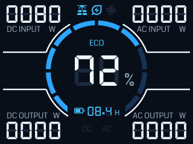
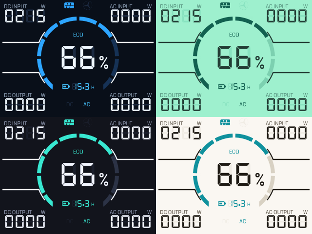

# bluetti-power-manager

A BLUETTI power-station dashboard for the [Pimoroni Tufty 2350](https://shop.pimoroni.com/products/tufty-2350), replicating the
unit's segmented front panel with data pulled live over BLE.



Everything runs on the badge, offline, over BLE with no cloud, no login, no subscription.

The BLE link is encrypted using a pure MicroPython reimplementation of the relevant portions
of BLUETTI's [official bluetooth library](https://github.com/bluetti-official/bluetti-bluetooth-lib).

If you want a more plug-and-play version of this, see [BLUETTI Magnetic Screen Display 1](https://www.bluettipower.co.uk/products/fridgepower-display-1?from=gadgetoid).

## Requirements

- Tufty 2350 running badgeware firmware v3.0.0 (needs `aioble`, `hashlib`
  with md5/sha256, and `cryptolib`)
- A BLUETTI on the V2 BLE protocol. Developed against an **Elite 200 V2**

## Install

Grab `bluetti_powman.zip` from the [latest release](../../releases/latest) (or
from the CI run's artefacts), then:

1. Double-tap **RESET** on the Tufty to bring up the USB disk (named `TUFTY`).
2. Unzip, and drop the whole `bluetti_powman` directory into `apps/`.
3. Eject, and launch it from the badge menu.

Set `BLUETTI_DEVICE` in `secrets.py` - the one at the root of the `TUFTY`
volume, alongside the WiFi details - to your unit's BLE address. A BLE scan
should show it: the advert name starts with the model, e.g. `Elite 200 V2<serial>`.

## Controls

| button | action |
| --- | --- |
| A | toggle the **AC output** |
| B | toggle the **DC output** |
| C | refresh now |
| up / down | cycle colour theme |
| home | exit to the launcher |

A and B write to the station's control registers and **physically switch its
outputs**, so anything plugged in loses or gains power. A press queues the
write and wakes the reader, which connects, writes, and reads back, so it might
take a couple of seconds to trigger.

## Themes

Up/down cycle four palettes: the BLUETTI blue, plus **luminescence** (a vintage
LCD green), **dark** and **light**, borrowed from [statsbadge](https://pimoroni.github.io/statsbadge/).



## The protocol

BLUETTI's V2 BLE is **not** plain Modbus. Service `0xff00`, `ff01` notify
(responses), `ff02` write (commands). Frames are:

```
2A2A <body> <sum16_be>
```

where the trailing two bytes are a plain additive sum of the body, not a CRC.

Access is gated by a mutually-signed ECDH handshake:

1. **Challenge** - device sends `2A2A 01 04 <nonce4> <sum>`.
   `iv = md5(reverse(nonce))`, `key = iv XOR LOCAL_AES_KEY`.
   Reply `2A2A 02 04 <iv[8:12]> <sum>`.
2. **Peer pubkey** - device sends an AES-CBC blob (that key/iv) holding a
   64-byte secp256r1 public key plus a 64-byte signature. Generate a keypair,
   ECDSA-sign `our_pubkey || iv` with the well-known `PRIVATE_KEY_L1`, and
   reply `2A2A 05 80 <our pubkey><sig>`, AES-wrapped.
3. **Accepted** - device replies type `06`; the session key is
   `ECDH(our private, peer public)`, the shared X coordinate.
4. **Reads** - Modbus `01 03 <addr><count> <crc16>` encrypted AES-CBC with the
   session key, per-message IV = `md5(4-byte seed)`.

### Registers (Elite/portable V2 map)

| register | meaning |
| --- | --- |
| 102 | state of charge, % |
| 104 | time remaining, minutes |
| 110 (6) | device type string |
| 116 (4) | serial number |
| 140 / 142 | DC / AC output power, W |
| 144 / 146 | DC / AC input power, W |
| 2011 / 2012 | AC / DC output switch (read and **writeable**) |
| 2014 / 2017 | DC / AC eco cutoff armed (drives the ECO indicator) |

Writes use Modbus function 6 (single register), which the device echoes back.

Eco mode is a *triple* per output - enable, hours, and a minimum-watt
threshold (AC: 2017/2018/2019, DC: 2014/2015/2016): the output switches itself
off after the load sits below that threshold for the chosen 1-4 hours. The
`ECO` indicator on the dashboard is driven from the two enable registers.
Other control registers in this range are documented in
`Patrick762/bluetti-bt-lib`: charging mode (2020, standard/silent/turbo/custom,
mains charging only), power lifting (2021) and the SoC charge limits
(2022/2023).

On these portables **DC input is the solar/PV input** - there is no separate PV
register (those exist only on the larger AC300/AC500/EP600 units), so the solar
indicator is driven from register 144. There is **no fan register** in this map,
so the fan indicator is drawn but never lit.

## Implementation notes

Things that cost real debugging time:

- **The device drops the link ~1.1s after connect** if the handshake has not
  finished. The budget is tight, so `prepare_keys()` precomputes the ephemeral
  keypair *and* the ECDSA signing nonce (`k`, `r`, `k⁻¹`) before connecting;
  signing then costs one modular multiply instead of a 375ms scalar mult.
- **The ECDH must be cooperative.** A 375ms fully-blocking Python loop starves
  MicroPython's single-threaded BLE stack and the device hangs up, so the
  scalar mult yields with `await asyncio.sleep_ms(0)` every 8 bit-iterations.
- Catch the type-`06` accept by returning to `notified()` straight after the
  pubkey reply; do the ECDH in that branch, then read immediately.
- Jacobian coordinates matter: one modular inverse per scalar mult instead of
  one per point add is 375ms vs 7.7s at 250MHz. Avoids needing C++ crypto libs.
- MicroPython has no async comprehensions, and `bytearray` has no
  `del buf[:n]` (use `buf[:] = buf[n:]`).
- Raise the MTU (`exchange_mtu(400)`); the pubkey reply is 146 bytes.

## Credits

- Protocol and keys cross-checked against BLUETTI's own crypto module
  ([bluetti-official/bluetti-bluetooth-lib](https://github.com/bluetti-official/bluetti-bluetooth-lib)),
  used only as a reference oracle during development - it is not needed at runtime.
- Handshake structure and register maps from
  [Patrick762/bluetti-bt-lib](https://github.com/Patrick762/bluetti-bt-lib),
  which derives from [nhurman/bluetti_mqtt](https://github.com/nhurman/bluetti_mqtt).
- [DSEG](https://github.com/keshikan/DSEG) by keshikan, SIL Open Font License.
- [Coda](https://fonts.google.com/specimen/Coda) by Vernon Adams, SIL Open Font
  License.
- [Material Symbols](https://fonts.google.com/icons) (Sharp, filled), Apache
  2.0 - the solar, eco, fan and battery glyphs.

## Fonts

`fonts.toml` is a manifest for [badgeware-fonts](https://github.com/pimoroni/badgeware-fonts). Coda and the
Material Symbols are merged into a single `.af`, so labels and status icons
come from one face; the icons keep their own codepoints (from `U+E000` up)
so they cannot collide with the text half:

```sh
uvx badgeware-fonts --manifest fonts.toml \
    build coda-symbols dseg7-classic --loose --out bluetti_powman/fonts
```

The `.af` files are build output and are not checked in - CI builds them and
packs the release zip. The two licence texts beside them are checked in, since
a `--loose` build writes only the fonts.

Glyphs used are listed in `corpus/bluetti-symbols.txt`: `solar_power`,
`energy_savings_leaf`, `mode_fan`, and `battery_android_frame_1..6` / `_full`,
the last of which is picked from the charge state.
